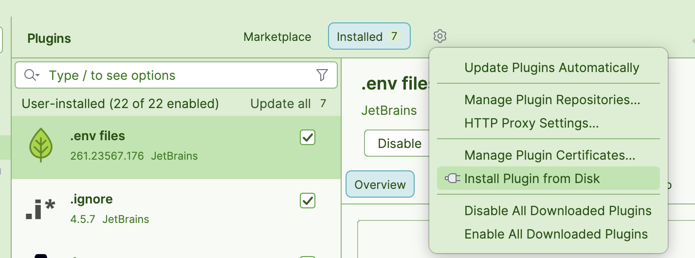
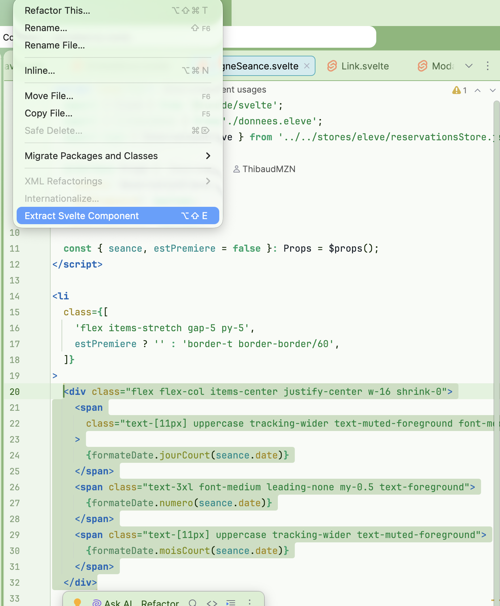

# Intellij Idea svelte component extractor

## Build
**Prerequisites**
- JDK 21
- Gradle

**Execute the following commands**
- `gradle :wrapper --gradle-version 9.0 --refresh-dependencies`
- `./gradlew buildPlugin --refresh-dependencies`
- `./gradlew build`

Once the build is complete, the plugin JAR file will be located in the `build/distributions/` directory.
Therefore you can mannually install the plugin in the IDE.

